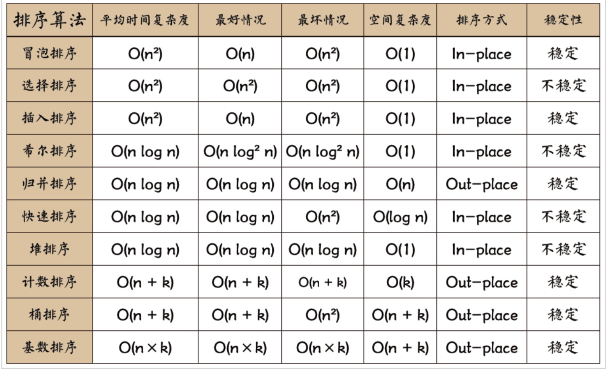
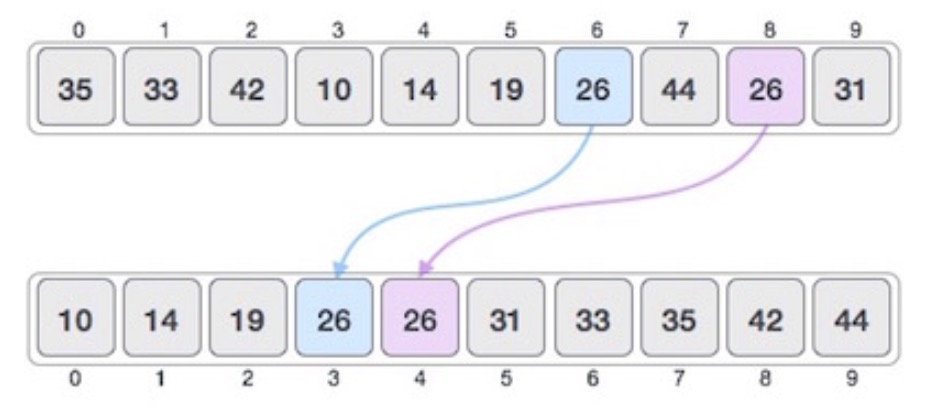
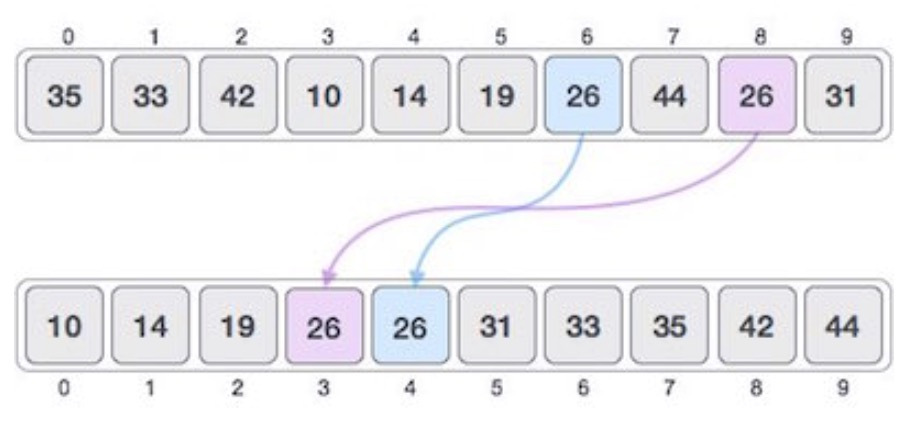

常用的排序算法有以下几种
- 冒泡排序
- 选择排序
- 插入排序
- 快速排序
- 归并排序



### 稳定性
在一个数组中，有两个元素是相等的，如果排序后原先在前面的元素仍旧在前面，那么这个排序算法是稳定的；反之则是不稳定的。



### 比较排序
使用比较操作来判断两个元素的元素大小，比如冒泡、插入，这种排序算法的时间复杂度最快为 `O(nlogn)`

### 非比较排序
计数排序、桶排序和基数排序，能够达到 `O(n)` 级别

### 交换
```js
// es5
function swap(nums, m, n) {
  let temp = nums[m]
  nums[m] = nums[n]
  nums[n] = temp
}
// es6
const swap = (nums, n, m) => {
  [nums[n], nums[m]] = [nums[m], nums[n]]
}
```

- 冒泡排序

从左到右依次比较相邻的两个元素，如果前一个比较大，就交换前一个与后一个位置，遍历一次之后保证最后一个元素最大；然后保持最后一个不变，遍历前 n-1 个元素，保证第 n-1 个元素最大；依次类推


- 选择排序

遍历自身以后的元素，最小的与自己调换位置
冒泡排序不停的交换元素，选择排序只需要每轮交换一次


- 插入排序

保持当前元素左侧始终是排序后的数组，然后将当前元素插入到前面排序完成的数组的对应的位置，使其保持排序状态。有点动态规划的感觉，类似于先把前i-1个元素排序完成，再插入第i个元素，构成i个元素的有序数组。


- 归并排序

把原来的数组变成左右两个数组，然后分别进行排序，当左右的子数组排序完毕之后，再合并这两个子数组形成一个新的排序数组。整个过程递归进行，当只剩下一个元素或者没有元素的时候就直接返回。


- 快速排序

